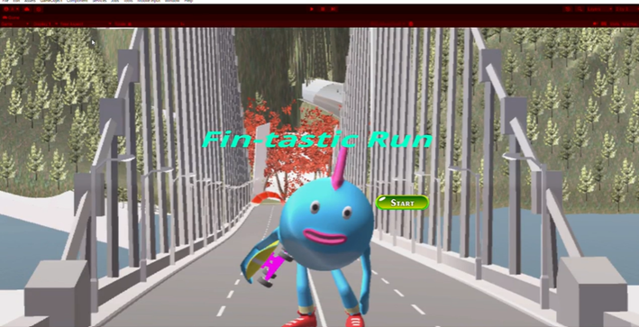
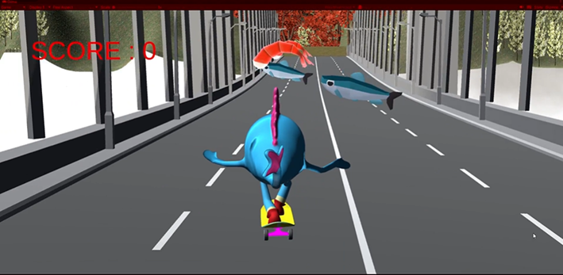
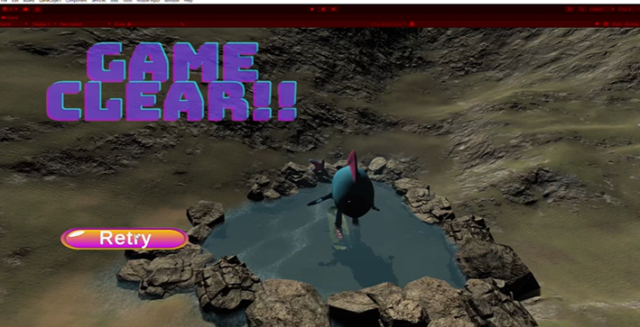
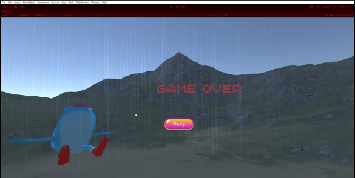

# ゲーム名：Fin-tastic Run

山間部を舞台にしたUnity製3Dレースゲームです。
スケートボードに乗ったキャラクターを操作し、様々な障害物を回避しながらゴール（温泉）を目指すゲームです。

## 概要
プレイヤーは山間部を舞台に設定されたコースを駆け抜け、スコアを稼ぎながらゴールを目指すことに加え、様々な障害物を回避しながらゴールを目指すゲームです。本作の特徴としては、UnityのTerrain機能を用いて一から作り上げてリアルな山の地形を作成したり、細かく設計した障害物、視点操作、スコア表示システム等プレイヤーの没入感を高める仕組みを充実させた。ゲーム内では山を再現するため高低差を持たせた地形編集を行い、道路や障害物を丁寧に配置した。さらに、滝や霧などの自然要素も取り入れることで山の風景も再現した。また、画面遷移や効果音、アニメーションを組み合わせることで、より楽しめるような空間を作成した。


| 項目 | 内容 |
|------|------|
| ジャンル | 3Dレースゲーム |
| エンジン | Unity |
| 言語 | C# |

---

## 操作方法

| キー | アクション |
|------|-----------|
| ↑ / ↓ | 前進 / 後退 |
| ← / → | 左右回転 |
| Space | ジャンプ |
| I | カメラを上に向ける |
| K | カメラを下に向ける |

---

## 主な機能

### ステージについて
- Unityの **Terrain** 機能を使って山の地形を一から手作業で作成
- **Easy Road 3D** アセットでコースをプロット
- 滝・霧・温泉などの自然要素をParticleSystemで再現

### 障害物（5種類）
1. **回る鶏** — ある点を軸に回転する
2. **上下する鹿** — Y軸方向に永続的に上下運動
3. **土砂崩れ** — プレイヤーが近づくと岩が落下してくる
4. **倒木** — プレイヤーが通過すると木がランダムな方向に倒れる（DoTween使用）
5. **泥沼** — 触れるとゲームオーバー

### スコアシステム
- **エビ**に触れる → +10点
- **魚**に触れる → -5点
- スコアは画面左上にリアルタイム表示（0点以下は赤色で表示）
- 取得済みオブジェクトは消滅し、衝突時に効果音が鳴る

### 画面遷移

- **タイトル画面** → **ゲーム本編** → **クリア画面** / **ゲームオーバー画面**
- ゲームオーバー時はプレイヤーが倒れるアニメーションと雨のエフェクトを表示

| タイトル画面 | ゲーム画面 |
|:-----------:|:---------:|
|  |  |

| クリア画面 | ゲームオーバー画面 |
|:---------:|:----------------:|
|  |  |

- ゲームオーバー時はプレイヤーが倒れるアニメーションと雨のエフェクトを表示

---

## 主なスクリプト

| スクリプト名 | 役割 |
|-------------|------|
| `PlayerController` | プレイヤーの移動・ジャンプ・回転 |
| `CameraController` | プレイヤー追従カメラの視点操作 |
| `GameOverTrigger` | 障害物との衝突検知・ゲームオーバー遷移 |
| `ScoreManager` | スコアの管理・UI表示更新 |
| `CollisionHandler` | エビ・魚との衝突によるスコア加減算 |
| `RotateAround` | オブジェクトを中心点に対して回転させる |
| `MoveCylinder` | オブジェクトを上下に永続運動させる |
| `LandslideTrigger` | トリガーエリアへの侵入で土砂崩れを発動 |
| `RotateObject` | 倒木アニメーション（DoTween使用） |
| `GoalChecker` | ゴール判定・クリア画面への遷移 |

---

## 使用技術・アセット

- **Unity** (2022.3系)
- **C#**
- **Easy Road 3D** — 道路の作成
- **DoTween** — スムーズな回転アニメーション
- **TextMeshPro** — スコアUI表示
- **Unity Terrain** — 山の地形生成
- **Unity ParticleSystem** — 滝・霧・温泉の湯気・雨の表現

---

## プロジェクト構成

```
Assets/
├── Scripts/
│   ├── PlayerController.cs
│   ├── CameraController.cs
│   ├── GameOverTrigger.cs
│   ├── ScoreManager.cs
│   ├── CollisionHandler.cs
│   ├── ShrimpBehavior.cs
│   ├── RotateAround.cs
│   ├── MoveCylinder.cs
│   ├── LandslideTrigger.cs
│   ├── RotateObject.cs
│   ├── GoalChecker.cs
│   ├── PlaySound.cs
│   └── button_game_start.cs
├── Scenes/
│   ├── Title.unity
│   ├── Main.unity
│   ├── Clear.unity
│   └── GameOver.unity
└── ...
```
## 補足
　PDF内で本ゲームの作成方法について詳しく載せています。
